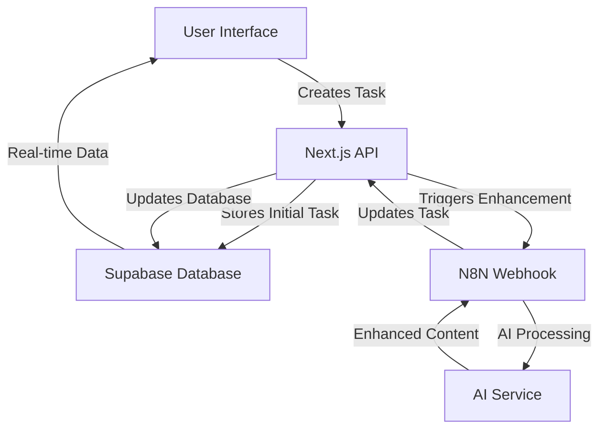

# 🤖 AI-Powered Todo Application

<div align="center">


**A sophisticated task management application that leverages AI automation to enhance your productivity**

</div>

---

## 🎯 **Project Overview**

This project was developed as part of the **AI Automation Developer Challenge**, demonstrating the integration of modern web technologies with intelligent automation workflows. The application transforms simple task entries into enhanced, actionable items using AI processing through N8N automation.

### ✨ **Key Features**

- 🧠 **AI-Enhanced Tasks**: Automatically improves task titles and descriptions using AI
- 📱 **Real-time Processing**: Visual feedback during AI enhancement
- 🔄 **Full CRUD Operations**: Complete task management capabilities
- 💾 **Persistent Storage**: Data stored securely in Supabase
- 🎨 **Modern UI**: Clean, responsive interface with smooth animations
- 🔗 **Custom API**: Self-built REST API for seamless integrations
- 🤖 **N8N Integration**: Powerful workflow automation

---

## 🏗️ **Architecture Overview**



### 🔧 **Tech Stack**

| Layer | Technology | Purpose |
|-------|------------|---------|
| **Frontend** | Next.js 13 + TypeScript | Modern React framework with App Router |
| **UI/UX** | Tailwind CSS + Framer Motion | Responsive design with smooth animations |
| **Backend** | Next.js API Routes | Custom REST API endpoints |
| **Database** | Supabase | PostgreSQL with real-time capabilities |
| **Automation** | N8N | Workflow automation and AI integration |
| **Deployment** | Vercel | Serverless deployment platform |

---

## 🚀 **Getting Started**

### Prerequisites

- Node.js 18+ 
- npm or yarn
- Supabase account
- N8N instance (cloud or self-hosted)

### 🛠️ **Installation**

1. **Clone the repository**
   ```bash
   git clone https://github.com/yourusername/ai-todo-app.git
   cd ai-todo-app
   ```

2. **Install dependencies**
   ```bash
   npm install
   # or
   yarn install
   ```

3. **Environment Setup**
   
   Create a `.env.local` file in the root directory:
   ```env
   # Supabase Configuration
   NEXT_PUBLIC_SUPABASE_URL=your_supabase_project_url
   NEXT_PUBLIC_SUPABASE_ANON_KEY=your_supabase_anon_key
   
   # N8N Webhook URL
   N8N_TODO_WEBHOOK=https://your-n8n-instance.com/webhook/todo-enhancement
   ```

4. **Database Setup**
   
   Execute this SQL in your Supabase SQL Editor:
   ```sql
   CREATE TABLE todos (
     id BIGINT PRIMARY KEY GENERATED ALWAYS AS IDENTITY,
     title TEXT NOT NULL,
     description TEXT,
     completed BOOLEAN DEFAULT FALSE,
     user_email TEXT NOT NULL,
     processing_status TEXT DEFAULT 'ready',
     created_at TIMESTAMP WITH TIME ZONE DEFAULT NOW(),
     updated_at TIMESTAMP WITH TIME ZONE DEFAULT NOW()
   );
   
   -- Enable Row Level Security
   ALTER TABLE todos ENABLE ROW LEVEL SECURITY;
   
   -- Create policy for user access
   CREATE POLICY "Users can access their own todos" ON todos
     FOR ALL USING (auth.email() = user_email);
   ```

5. **Run the development server**
   ```bash
   npm run dev
   # or
   yarn dev
   ```

   Open [http://localhost:3000](http://localhost:3000) in your browser.

---

## 🔄 **How It Works**

### 📝 **Task Creation Flow**

1. **User Input**: User enters a task title and optional description
2. **API Processing**: Next.js API creates the task with `processing` status
3. **AI Enhancement**: N8N webhook is triggered automatically
4. **AI Processing**: Task is sent to AI service for enhancement
5. **Database Update**: Enhanced task is stored back in Supabase
6. **UI Update**: User sees the enhanced task with visual indicators

### 🎯 **API Endpoints**

#### `POST /api/todos`
Creates a new task and triggers AI enhancement
```typescript
// Request
{
  "title": "Study React",
  "description": "Learn hooks",
  "userEmail": "user@example.com"
}

// Response
{
  "id": 1,
  "title": "Study React - Complete Hooks Tutorial",
  "description": "Learn React hooks including useState, useEffect, and custom hooks with practical examples",
  "completed": false,
  "processing_status": "ready"
}
```

#### `GET /api/todos?userEmail=user@example.com`
Retrieves all tasks for a specific user

#### `PATCH /api/todos`
Updates existing task (title, description, or completion status)

#### `DELETE /api/todos`
Removes a task from the database

---

## 🧠 **AI Enhancement Process**

The application uses N8N to create an intelligent workflow that enhances user input:

### 🔧 **N8N Workflow Steps**

1. **Webhook Trigger**: Receives task data from the Next.js API
2. **AI Processing**: Sends task to AI service (OpenAI/Claude/etc.)
3. **Enhancement Logic**: 
   - Improves task clarity
   - Adds relevant details
   - Breaks down complex tasks
   - Suggests actionable steps
4. **Response**: Returns enhanced content to the API
5. **Database Update**: Stores improved task in Supabase

### 📊 **Processing Status**

The application provides real-time feedback through processing status:

- `processing`: Task is being enhanced by AI
- `ready`: Task enhancement is complete
- `failed`: Enhancement failed (fallback to original)

---

## 🎨 **Features Deep Dive**

### 🖥️ **User Interface**

- **Dark Theme**: Modern dark mode design
- **Responsive Layout**: Works on desktop and mobile
- **Animation System**: Smooth transitions using Framer Motion
- **Real-time Updates**: Instant feedback during AI processing
- **Task Statistics**: Visual dashboard with completion metrics

### 📊 **Task Management**

- **Smart Categorization**: Automatically organizes tasks by status
- **Inline Editing**: Edit tasks directly in the interface
- **Bulk Operations**: Mark multiple tasks as complete
- **Search & Filter**: Find tasks quickly (future enhancement)

### 🔐 **Data Management**

- **User Isolation**: Each user sees only their tasks
- **Data Persistence**: All changes saved automatically
- **Error Handling**: Graceful handling of network issues
- **Optimistic Updates**: UI updates immediately for better UX

---

## 🧪 **Testing the Application**

### 🚀 **Live Demo Testing**

Visit the https://ai-automation-developer.vercel.app/ and follow these steps:

1. **Authentication**
   ```
   Enter any email address (e.g., test@example.com)
   Click "Login"
   ```

2. **Create Enhanced Task**
   ```
   Title: "learn python"
   Description: "basics"
   Click "Add Task"
   ```
   
   Watch for the processing indicator and see how AI enhances it to something like:
   ```
   Title: "Learn Python - Complete Beginner's Guide"
   Description: "Master Python basics including variables, functions, loops, and data structures with hands-on exercises"
   ```

3. **Test CRUD Operations**
   - ✏️ Click "Edit" to modify tasks
   - ✅ Check boxes to mark complete
   - 🗑️ Click "Delete" to remove tasks
   - 🔄 Click "Reload" to refresh data

### 🛠️ **Local Testing**

1. **Start the development server**
   ```bash
   npm run dev
   ```

2. **Test API endpoints directly**
   ```bash
   # Create a task
   curl -X POST http://localhost:3000/api/todos \
     -H "Content-Type: application/json" \
     -d '{"title":"Test task","userEmail":"test@example.com"}'
   
   # Get tasks
   curl "http://localhost:3000/api/todos?userEmail=test@example.com"
   ```

3. **Check N8N integration**
   - Verify webhook URL in environment variables
   - Monitor N8N workflow execution
   - Check Supabase for data updates

---

## 🏆 **Challenge Requirements**

### ✅ **Part 1 - Todo List App**
- ✅ Framework: Next.js
- ✅ Database: Supabase (persistent storage)
- ✅ Hosting: Vercel
- ✅ Features: Add, Edit, Complete, Persistent data

### ✅ **Part 2 - Chatbot Enhancement**
- ✅ N8N Integration: Mandatory workflow automation
- ✅ Supabase Connection: Via custom API
- ✅ AI Enhancement: Automatic task improvement
- ✅ **BONUS**: Custom API implementation

### 🎁 **Bonus Features Implemented**
- 🌟 **Custom REST API**: Full CRUD operations
- 🎨 **Enhanced UX**: Real-time processing indicators
- 📊 **Task Analytics**: Completion statistics
- 🔄 **Error Handling**: Robust error management
- 📱 **Responsive Design**: Mobile-friendly interface

---

## 📁 **Project Structure**

```
src/
├── app/
│   ├── api/
│   │   └── todos/
│   │       └── route.ts         # Custom API endpoints
│   ├── layout.tsx               # App layout
│   └── page.tsx                 # Main application
├── components/
│   ├── AddTodoForm.tsx          # Task creation form
│   ├── TodoItem.tsx             # Individual task component
│   └── TodoList.tsx             # Task list container
├── lib/
│   ├── api.ts                   # API service helpers
│   ├── n8n.ts                   # N8N integration utilities
│   └── supabase.ts              # Database configuration
└── types/
    └── todo.ts                  # TypeScript definitions
```

---

## 🔮 **Future Enhancements**

- 📱 **WhatsApp Integration**: Create tasks via WhatsApp messages
- 🔍 **Advanced Search**: Filter and search capabilities
- 📅 **Due Dates**: Task scheduling and reminders
- 👥 **Collaboration**: Share tasks between users
- 📊 **Advanced Analytics**: Productivity insights
- 🌍 **Internationalization**: Multi-language support

---

## 📚 **Learning Resources**

- [Next.js Documentation](https://nextjs.org/docs)
- [Supabase Guides](https://supabase.com/docs)
- [N8N Documentation](https://docs.n8n.io/)
- [TypeScript Handbook](https://www.typescriptlang.org/docs/)
- [Tailwind CSS](https://tailwindcss.com/docs)

---

## 👨‍💻 **Developer**

Created with ❤️ by **Thales Fiscus** as part of the AI Automation Developer Challenge.

**Contact:**
- 📧 Email: thalesgabriel07@gmail.com
- 💼 LinkedIn: https://www.linkedin.com/in/thalesf01/
- 🐙 GitHub: https://github.com/ThalesF01
---

<div align="center">

**⭐ If you found this project helpful, please give it a star!**

[](https://nextjs.org/)
[](https://supabase.com/)
[](https://n8n.io/)

</div>
